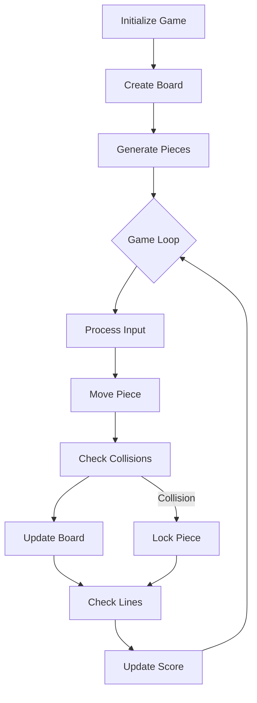

<h1>ÆTHERWORKS: LIQUID MATRIX TETRIS</h1>
<h3>A Modern Reimagining of the Classic Game</h3>

By Ravi Sai Vigneswara

    
    
    

---

## 📜 Table of Contents
1. [Project Overview](#-project-overview)
2. [History of Tetris](#-history-of-tetris)
3. [Why "Liquid Glass" UI/UX?](#-why-liquid-glass-uiux)
4. [UI/UX Design Principles Applied](#-uiux-design-principles-applied)
5. [Key Features](#-key-features)
6. [Workflow & Architecture](#-workflow--architecture)
7. [Technical Implementation](#-technical-implementation)
8. [How to Play](#-how-to-play)
9. [Future Enhancements](#-future-enhancements)
10. [About the Author](#-about-the-author)

---

## 🎮 Project Overview
**ÆTHERWORKS: Liquid Matrix Tetris** is a modern, visually immersive take on the classic Tetris game featuring:

- **"Liquid Glass" UI** - Frosted-glass aesthetic with dynamic lighting
- **Microinteractions** - Smooth animations for all game actions
- **Responsive Design** - Playable on desktop and mobile
- **Audio Feedback** - Web Audio API generated sound effects

Built with pure **HTML5, CSS3, and vanilla JavaScript** - no frameworks or libraries.

---

## 📜 History of Tetris
Created by **Russian programmer Alexey Pajitnov in 1984**, Tetris is one of the most successful video games of all time due to:

- **Simple Rules**: Arrange falling blocks to complete lines
- **Mathematical Foundation**: Based on geometric tiling theory
- **Psychological Appeal**: Creates the "Tetris Effect" of seeing patterns in real life

This project honors that legacy while reimagining the visual experience.

---

## 🪩 Why "Liquid Glass" UI/UX?

### Design Philosophy:
1.  **Futuristic Aesthetic**
    -   Frosted-glass panels with `backdrop-filter: blur(10px)`
    -   Neon-accented tetrominoes with glow effects
    -   Animated bubble background

2.  **Enhanced Game Feel**
    -   Tactile microinteractions for all actions
    -   Visual feedback (pulse animations, color shifts)
    -   Adaptive difficulty curve

3.  **Psychological Impact**
    -   Glass morphism creates depth and immersion
    -   Softer colors reduce visual fatigue

---

## 🎨 UI/UX Design Principles Applied

| Principle | Implementation Example |
| :--- | :--- |
| **Consistency** | Uniform styling across elements |
| **Feedback** | Visual + audio cues for actions |
| **Minimalism** | Clean interface with no clutter |
| **Affordance** | Obvious interactive elements |
| **Accessibility**| High contrast color scheme |

---

## 🚀 Key Features

### Gameplay
- All 7 classic tetromino shapes
- Score multiplier based on lines cleared
- Progressive difficulty (speed increases)

### Technical
- Pure vanilla JavaScript implementation
- CSS Grid for game board layout
- Web Audio API for sound effects

### Visual
- Animated piece locking/clearing
- Responsive design for all screens
- 60FPS smooth animations

---

## 🔧 Workflow & Architecture

**Core Systems:**

-   **Rendering:** CSS Grid + DOM manipulation
-   **Game Logic:** Matrix transformations for pieces
-   **State Management:** Tracking score/level

---

## 🛠 Technical Implementation
**Key Functions:**

-   `rotatePiece()`: Matrix transformation with wall kicks
-   `checkCollision()`: Boundary and piece detection
-   `lockPiece()`: Merging piece with board
-   `clearLines()`: Row completion logic

**Optimizations:**

-   Efficient DOM updates
-   Event delegation for controls
-   CSS hardware acceleration

---

## 🎮 How to Play
**Controls:**

-   **Desktop:**
    -   `←` `→` : Move piece
    -   `↑` : Rotate
    -   `↓` : Soft drop
    -   `Space`: Hard drop
-   **Mobile:**
    -   On-screen touch controls

**Scoring:**
| Lines | Points |
| :--- | :--- |
| 1 | 100 × Level |
| 2 | 300 × Level |
| 3 | 500 × Level |
| 4 | 800 × Level |

---

## 🔮 Future Enhancements

-   [ ] Hold piece functionality
-   [ ] Local high score tracking
-   [ ] Custom theme selector
-   [ ] Multiplayer mode

---

## 👨‍💻 About the Author

**Ravi Sai Vigneswara**

-   Creative Developer & UI/UX Designer
-   Specializing in immersive web experiences
-   **Portfolio:** [Coming Soon]

**Connect:**

-   **GitHub:** [@ravisaivigneswara](https://github.com/ravisaivigneswara)

> "ÆTHERWORKS" represents the fusion of classic gameplay with cutting-edge design.

---

## 📜 License
[MIT License](LICENSE)
 
© 2024 Ravi Sai Vigneswara | All Rights Reserved
